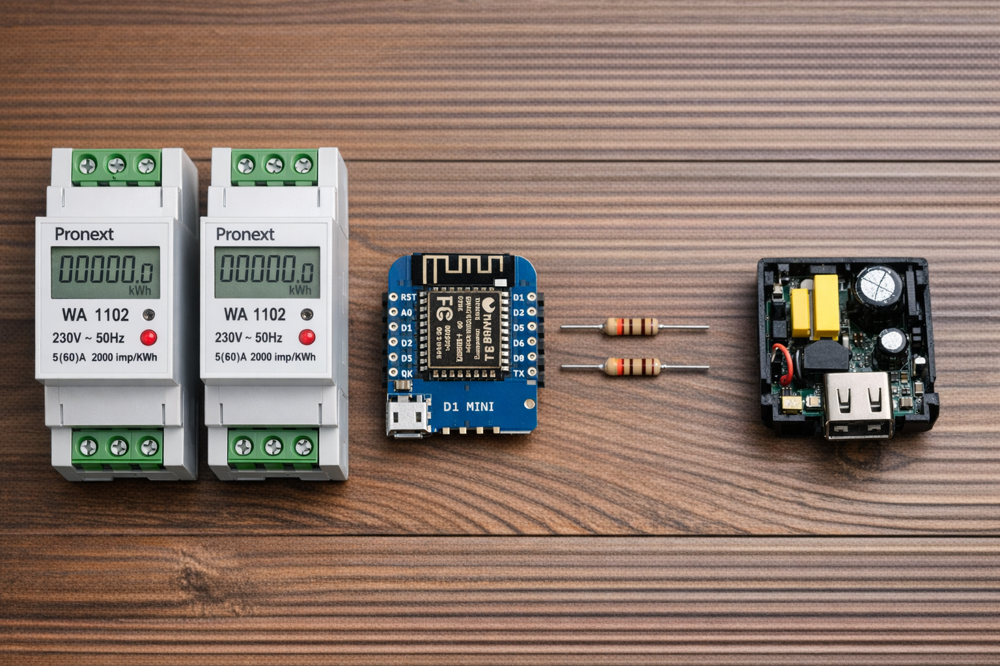
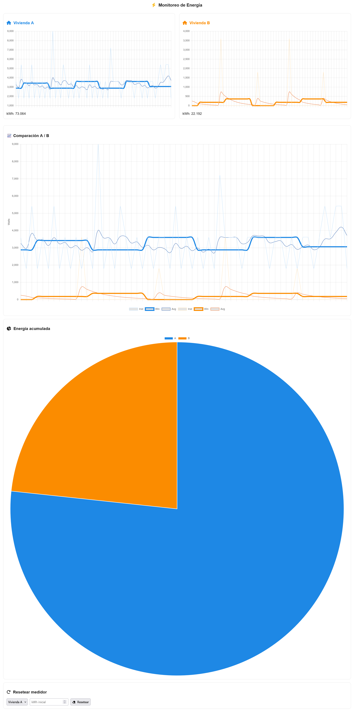

# acdc-meter
Metering AC power usage at home

Components:
- 2 x Pronext Wa 1102 Power meter with 2000 pulses/kwh output terminals
- D1 Mini (esp8266)
- 2 x 330 ohm resistors
- 5v power adapter (removed case)

(don't pay attention to details...IA render)

Connection:

- 5v adapter input to AC line (110/220)
- 5v adapter output to D1 Mini 5v/GND pins (or just use a usb cable)
- D1 Mini D5 pin to 330 resistor, then to first Wa1102 pulse terminal 1 (in my case there's no polarity)
- D1 Mini D6 pin to 330 resistor, then to second Wa1102 pulse terminal 1
- D1 Mini GND pin to first Wa1102 pulse terminal 2
- D1 Mini GND pin to second Wa1102 pulse terminal 2

Usage:

Open the page in the web browser (good idea to reserve the IP in your router) \
This is also linked to Thingspeak charts for long term analysis \
\
You can reset the counters to match what you have in your official AC meter

